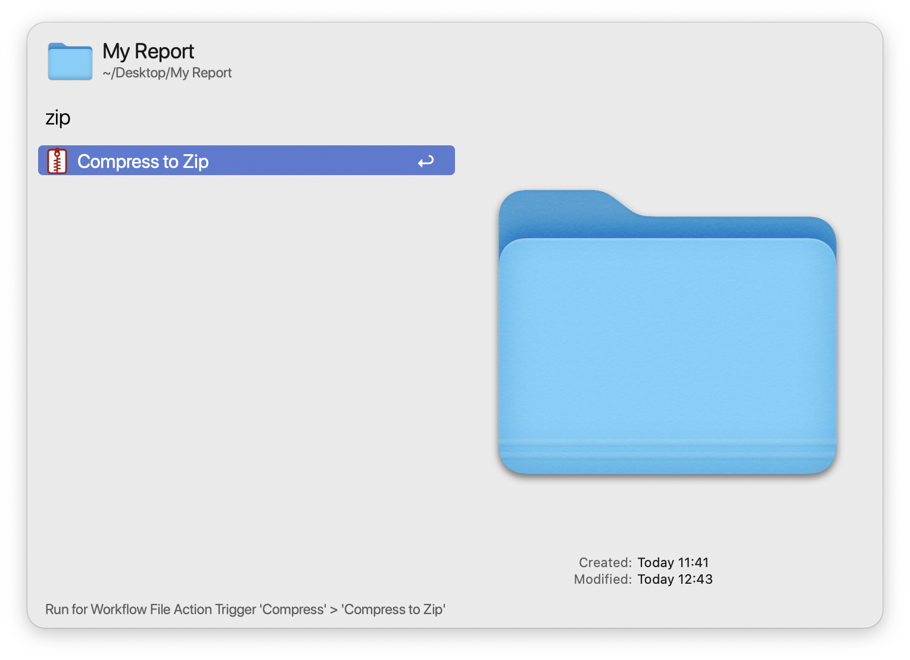

# Alfred Compress

A universal action that compresses the selected file or folder to create a zip file in the same directory.

To use, select a file or folder in Finder and trigger Alfred's universal actions. Start typing "compress" or "zip" in order to find the "Compress to Zip" action and then press enter to create a Zip file. 

For a single selection, a Zip file of the same name as the selection will appear in the Finder window. For a selection of multiple files/folders, then the Zip file will be named "files.zip".

If you press The Option(⌥) key, then each selection will be compressed to a separate ZIP file.

